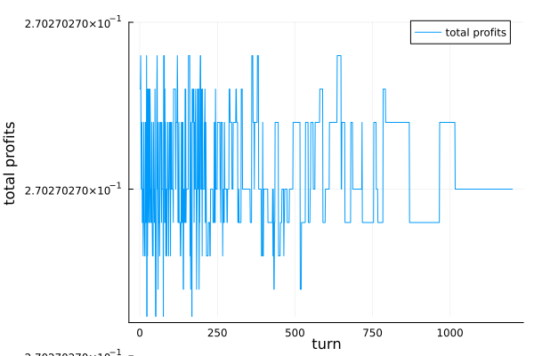

# Cobb-Douglas Economy

```julia
include("Firms.jl")
include("Dynamics.jl")
include("DynamicsType.jl")
include("Utils.jl")
include("Utils_2.jl")
using Graphs, Plots

n = 100 # number of firms
# networks
technologyMatrix = getRegularMatrix(n, 8)
supplyChain = getSupplyMatrix(technologyMatrix)
# generate economy with heterogeneous productivities
dynamicsTimeSeries = getHetEconomy(
            n,
            technologyMatrix,
            supplyChain,
            30,
            -1, # tau, -1 is tau = infinity
        )
rho = 1.0 # cost of rewiring
computeDynamics!(dynamicsTimeSeries, DeterministicDynamics(rho))
lastRound = dynamicsTimeSeries.currentRound[1] # == 30 if the economy did not converge
profitsTimeSeries = dynamicsTimeSeries.profitTimeSeries[1:lastRound*n,1:n]
plot(sum(profitsTimeSeries,dims=2), label="total profits")
xlabel!("turn")
ylabel!("total profits")
```

