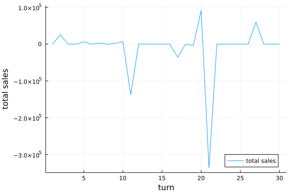
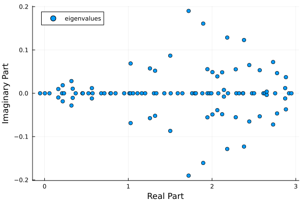

# Leontief Economy

```julia
include("LeontiefRewiring.jl")
using Graphs, .LeontiefRewiring, Plots, LinearAlgebra, Random

Random.seed!(123) # fix seed for example

n = 100 # number of firms
# networks
technologyMatrix = getRegularMatrix(n, 8)
supplyChain = getSupplyMatrix(technologyMatrix)
# generate economy with heterogeneous productivities
dynamicsTimeSeries = getHetEconomy(
            n,
            technologyMatrix,
            supplyChain,
            30,
            -1, # tau, -1 is tau = infinity
        )
rho = 1.0
totalSalesTimeSeries = zeros(30)
currentRound = 0
while currentRound < 30
    currentRound += 1
    hasNotConverged = computeRound!(dynamicsTimeSeries, rho)
    totalSalesTimeSeries[currentRound] = sum(dynamicsTimeSeries.state.sales)
    if !hasNotConverged
        break
    end
end
plot(totalSalesTimeSeries[1:currentRound], label="total sales")
xlabel!("turn")
ylabel!("total sales")

```



What happened why did the total sales become negative?

```julia
M = get_M_Matrix(dynamicsTimeSeries.state)
e = eigvals(M)
scatter(real(e), imag(e), label="eigenvalues")
xlabel!("Real Part")
ylabel!("Imaginary Part")
```



Of course! The eigenvalue of the M matrix crossed zero, the economy is in a crisis.