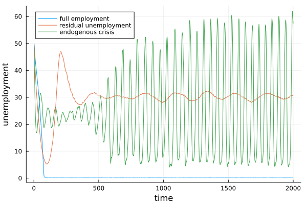
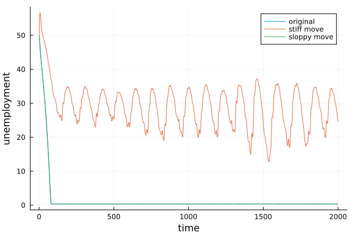

# differentiable_Mark0

A differentiable implementation of Mark0 based on the original C++ code.

Usage to replicate the Mark0 phase transition.

```julia
include("new_mark0.jl")
using Plots

par = getParameters()
u1 = mark0_noCB(par, 2000, 41, 2000) # full employment
par[1] = 0.02
u2 = mark0_noCB(par, 2000, 41, 2000) # residual unemployment
par[1] = 0.08
par[2] = 5.0
u3 = mark0_noCB(par, 2000, 41, 2000) # endogenous crises
plot(100 * u1, label="full employment")
plot!(100 * u2, label="residual unemployment")
plot!(100 * u3, label="endogenous crisis")
xlabel!("time")
ylabel!("unemployment")
```




To get sloppy/stiff directions and compute the Hessian of the squared loss. Note we do not seek the hessian of the model, but rather a hessian of the mean squared loss of the sensitivity.

```julia
include("new_mark0.jl")
include("hessian.jl")
using ForwardDiff # note that the model is from 14 -> 200000 
using LinearAlgebra, Plots

par = getParameters()
lpar = log.(par) # log of parameters for calculations as dy(x)/dlog(x) = dy(e^u) / du
f(p) = mark0_noCB(exp.(p), 2000, 41, 30000, 10000) # as in the paper
@time A = ForwardDiff.jacobian(f, lpar) # 100s! a x27 times speed up, also note there is no need for such a long time series
"""
Note, the computed Jacobian is *not* correct! There are some issues with AD to clean up!
"""
output = f(lpar)
jacobian = reshape(A, (20000,14,1)) # last dimension is for extra sampling

H = constructHessian(jacobian, output)
issymmetric(H) == true # as expected
V, D = eigen(Symmetric(H))
# lets see if the Hessian is any good

stiff = D[:, end] # eigenvector of largest eigenvalue
sloppy = D[:, 4] # eigenvector of fourth eigenvalue the first three are incorrect
norm(stiff) == norm(sloppy) == true # they are both of the same size

f(p) = mark0_noCB(exp.(p), 2000, 41, 2000) # smaller time-series
plot(100 * f(lpar), label="original")
plot!(100 * f(lpar + stiff), label="stiff move")
plot!(100 * f(lpar + sloppy), label="sloppy move")
xlabel!("time")
ylabel!("unemployment")
# great success!
```


